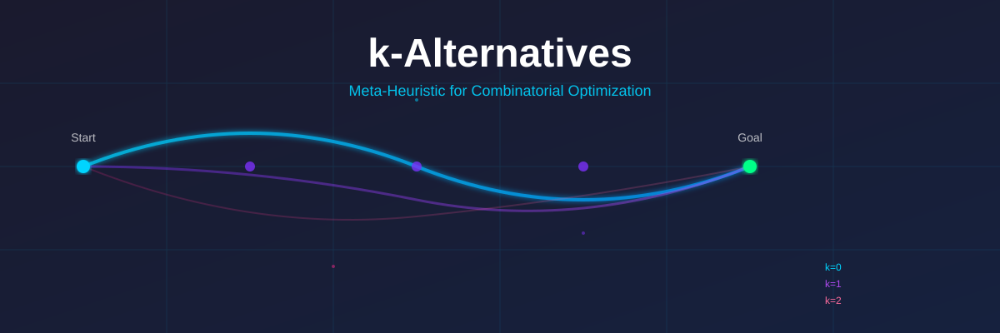

# k-Alternatives: A General-Purpose Meta-Heuristic



[](paper/paper.pdf)
[](LICENSE)
[](tests/)

📄 **Academic Paper:**
[**$k$-Alternatives: A Discrepancy-Bounded Constructive Meta-Heuristic with Online Heuristic Reordering (PDF)**](paper/paper.pdf)
| [LaTeX Source](paper/paper.tex)  
✍️ **Author:** Mario Raúl Carbonell Martínez
([marioraulcarbonell@gmail.com](mailto:marioraulcarbonell@gmail.com))

**k-Alternatives** is a stochastic search algorithm designed to optimize
combinatorial problems by exploring controlled deviations from a heuristic
baseline.

Originally designed for the **Traveling Salesperson Problem (TSP)**, the
architecture has been generalized to solve other optimization problems, such as
the **Knapsack Problem**, demonstrating remarkable robustness.

## 🧠 The Core Concept

The algorithm combines **Limited Discrepancy Search (LDS)** with **Multi-Start
Construction** and an **adaptive candidate-list reinforcement policy
(Move-to-Front)**.

### 1. Base Heuristic

The algorithm relies on a greedy heuristic to guide solution construction:

- **TSP**: "Nearest Neighbor" - at each step, choose the closest unvisited city
- **Knapsack**: "Value/Weight Ratio" - sort items by efficiency and choose the
  best available
- **General**: Any local decision heuristic that suggests the "best next choice"

### 2. k-Deviations

Instead of always following the heuristic, the algorithm allows up to **k
"sub-optimal" choices** (deviations) during construction:

- **k=0**: Pure greedy - always follow the best heuristic choice
- **k=1**: Try the second-best choice once
- **k=2**: Try alternatives twice, exploring a wider solution space
- **k=n**: Eventually reaches exhaustive search

### 3. Multi-Start Strategy

The solver builds solutions from different starting points to avoid local
minima:

- **TSP**: Start tours from different cities
- **Knapsack**: Force the greedy construction to start with different items
- This systematic exploration ensures diverse solution coverage

## 🧠 Adaptive Learning: Candidate-List Reinforcement (Move-to-Front)

At the core of the algorithm's learning capability is an online reordering
mechanism inspired by classical **Move-to-Front (MTF)** list update rules and
**reinforcement of candidate lists** (akin to LRTA\* and Expert Advice).

### How Learning Works

When the algorithm discovers a **better solution**, it reinforces the successful
decisions by promoting those transitions to the head of the candidate heuristic
lists:

```javascript
// When a better route is found, successful edges move to the front
function updateHeuristics(improvedRoute) {
    for (let i = 0; i < improvedRoute.length - 1; i++) {
        const city1 = improvedRoute[i];
        const city2 = improvedRoute[i + 1];

        // Move successful connection to front of heuristic list
        if (heuristics[city1][0] !== city2) {
            heuristics[city1] = [
                city2,
                ...heuristics[city1].filter((c) => c !== city2),
            ];
        }
        // Same for the reverse edge
        if (heuristics[city2][0] !== city1) {
            heuristics[city2] = [
                city1,
                ...heuristics[city2].filter((c) => c !== city1),
            ];
        }
    }
}
```

**Result**: Successful transitions become the default "greedy choice" ($k=0$)
for subsequent search passes, allowing future iterations to exploit discovered
structure at minimal computational cost.

### Conceptual Mapping to Reinforcement Learning

| Optimization Concept | k-Alternatives Realization                                            |
| :------------------- | :-------------------------------------------------------------------- |
| **State**            | Current partial tour / solution prefix                                |
| **Action**           | Next item / city selected from unvisited candidates                   |
| **Policy $\pi$**     | Ranked heuristic candidate list (`localHeuristics[state]`)            |
| **Reward**           | Improvement in global objective value                                 |
| **Exploitation**     | Greedy choice ($k=0$ follows the top learned choice)                  |
| **Exploration**      | Discrepancy budget $k$ (trying 2nd, 3rd, ..., $(k+1)$-th alternative) |
| **Learning Step**    | Move-to-Front reordering on confirmed global improvements             |

### Key Strengths of this Formulation

1. **Zero Hyperparameters**: Operates with a single intuitive control parameter:
   the discrepancy budget $k$.
2. **Transparent & Interpretable**: Inspecting `localHeuristics[city]` reveals
   exactly which transitions the solver has reinforced.
3. **Low Overhead**: $O(N \cdot C)$ update cost (where $C$ is the candidate list
   size), with no matrix inversions or neural inference.
4. **Deterministic Reproducibility**: Full reproducibility using seeded PRNG
   (`options.seed`).

## 🚀 Features

- **Generic Framework:** A `KDeviationOptimizer` base class that implements the
  core search logic, agnostic of the specific problem.
- **Adaptive Learning:** Heuristics evolve based on successful solutions,
  creating a "memory" of good decisions.
- **TSP Solver:**
    - Supports TSPLIB format (EUC_2D, GEO, EXPLICIT matrices).
    - Visualizer included (`public/index-legacy.html`).
    - Consistently finds solutions within **2-3% of the optimal** for
      medium-sized problems (N=50-100).
- **Knapsack Solver:**
    - Adapts the logic to use a **Global Heuristic** (Efficiency Ratio).
    - Successfully solves **Strongly Correlated** hard instances (Pisinger).
    - Demonstrates that a "Multi-Start Greedy" approach is extremely powerful
      for this domain.
- **CLI & Web Worker Support:** Runs in Node.js for benchmarks and in the
  browser for visualization.

---

## 🔬 Related Work & Algorithmic Novelty

In meta-heuristics, novelty often arises not from isolated primitives, but from
their **concrete formulation, coupling, and theoretical interpretation**.
k-Alternatives integrates and builds upon key foundations in heuristic search:

### Prior Art & Neighbors

| Related Paradigm                     | Core Reference                               | Relationship & Key Difference                                                                                                                                                                              |
| :----------------------------------- | :------------------------------------------- | :--------------------------------------------------------------------------------------------------------------------------------------------------------------------------------------------------------- |
| **Limited Discrepancy Search (LDS)** | Harvey & Ginsberg (IJCAI 1995)               | LDS searches tree/CSP structures with a static heuristic. k-Alternatives applies discrepancy budgets to **greedy permutation construction** with an online evolving policy.                                |
| **Move-to-Front (MTF) & LRTA\***     | Sleator & Tarjan (CACM 1985); Korf (AI 1990) | Classical MTF updates static lists; here, MTF acts as an **online policy reinforcement step** coupled with discrepancy search.                                                                             |
| **Focal Discrepancy Search**         | Greco, Araneda & Baier (SOCS 2022)           | Combines LDS with learned heuristics, but uses a **frozen, pre-trained neural heuristic** on single-agent puzzles. k-Alternatives learns **in-instance and online**.                                       |
| **Iterated Local Search (ILS)**      | Lourenço, Martin & Stützle (2003)            | ILS perturbs solutions and applies local search (e.g., 2-opt). k-Alternatives operates via **controlled discrepancy construction** and heuristic re-ranking without requiring explicit neighborhood moves. |

### The Distinctive Algorithmic Recipe

1. **Discrepancy over Constructive Search**: The parameter $k$ directly controls
   the exploration-exploitation balance during permutation construction.
2. **Self-Modifying Policy**: Improved solutions rewrite `localHeuristics` in
   real time, so that subsequent $k=0$ passes immediately exploit learned
   knowledge.
3. **Coupled Schedule (Learn $\to$ Re-exploit $\to$ Explore)**: Upon finding an
   improvement, the solver resets to $k=0$ to replay the reinforced greedy
   policy before progressively incrementing $k$.
4. **Continuous Interpretation ($k \leftrightarrow \tau/\lambda$)**: As derived
   in
   [docs/puente-gradiente-k-alternatives.md](docs/puente-gradiente-k-alternatives.md),
   Move-to-Front is mathematically equivalent to an _Exponentiated Gradient /
   Mirror Descent_ step (with KL divergence) followed by discretization, and $k$
   acts as a quantized temperature $\tau$.

---

## ⚖️ Algorithmic Trade-offs & Use Cases

k-Alternatives occupies a practical middle ground: significantly more robust
than pure greedy heuristics, yet far simpler to implement and deploy than
complex iterative search frameworks.

| Approach                       | Search Type                   | Parameters to Tune                     | Solution Memory        | Typical Gap (N=50–100) |
| :----------------------------- | :---------------------------- | :------------------------------------- | :--------------------- | :--------------------- |
| **Nearest Neighbor (Greedy)**  | Constructive                  | None                                   | None                   | 12% – 25%              |
| **Random-Restart NN**          | Multi-start Constructive      | Seed / Runs                            | None                   | 8% – 15%               |
| **2-Opt (Local Search)**       | Iterative Improvement         | Restarts, neighborhood                 | None                   | 3% – 7%                |
| **Simulated Annealing**        | Stochastic Local Search       | Cooling schedule, $\tau_0$, iterations | Low                    | 2% – 5%                |
| **Genetic Algorithms (GA)**    | Population-based              | Mutation, crossover, pop size          | Population             | 2% – 6%                |
| **k-Alternatives (This work)** | Multi-Start Discrepancy + MTF | **Only $k$** (or auto)                 | Ranked candidate lists | **1% – 3%**            |

### Ideal Scenarios

1. **Embedded & Client-Side Systems**: Fast route generation directly inside web
   browsers (via JavaScript/Web Workers) or mobile apps without server-side
   solver dependencies.
2. **Game AI & Real-Time Logistics**: Path planning for units visiting multiple
   targets where greedy heuristics produce unrealistic paths and heavy solvers
   introduce prohibitive latency.
3. **Zero-Configuration Heuristics**: Applications where manual hyperparameter
   tuning (cooling rates, mutation schedules, population sizes) is impractical
   or impossible.

---

## 🌍 TSP Implementation & Benchmarks

The TSP solver (`tsp-solver.js`) uses the "Nearest Neighbor" approach as its
base heuristic. The `k-Alternatives` meta-algorithm then explores permutations
of starting cities and `k` deviations from this greedy path.

### Key Findings

- **Small/Medium Problems (N < 100):** The algorithm is highly effective and
  fast, consistently finding optimal or near-optimal solutions.
    - `berlin52` (N=52): Achieves **30.0% success rate** with K=3 in ~3 seconds,
      with an average cost only 2.27% above optimal.
    - `st70` (N=70): A harder landscape. With K=3, the average cost is 2.36%
      above optimal, but often requires more time to converge within a single
      run.
- **Larger Problems (N >= 100):** The search space grows exponentially, making
  higher K values computationally expensive.
    - `kroA100` (N=100): With K=2, it achieved an optimal solution in 10% of
      runs, with an average cost 1.62% above optimal, within 4 seconds.
    - `ch130` (N=130): Similar performance, with K=2 achieving solutions
      averaging 3.17% above optimal, within the 10-second time limit.

**Strategy for Larger TSP Instances:** For problems with N > 100, a multi-start
strategy with lower K (e.g., K=1 or K=2) across many runs is generally more
efficient than a single run with a very high K. Further optimizations, such as
candidate lists or integration with more advanced local search (e.g.,
2-opt/3-opt), would be necessary to tackle very large TSP instances (N > 1000).

---

## 🎒 Knapsack Implementation & Benchmarks

We adapted the algorithm to the 0/1 Knapsack Problem (`knapsack-solver.js`) to
test its generality.

### Architecture Adaptation

Unlike TSP, which uses local heuristics (nearest neighbors relative to the
current city), the Knapsack solver uses a **Single Global Heuristic**: items
sorted by their Value/Weight ratio.

- **K=0 (Multi-Start Greedy):** Tries to fill the knapsack greedily, but repeats
  the process forcing it to start with the 1st item, then the 2nd, then the 3rd,
  etc. This is enabled by setting `shuffle: false` in the `KDeviationOptimizer`
  options, which makes the multi-start deterministic based on the heuristic
  order.
- **K>0:** Allows skipping the "next best" item to try a lower-ratio item,
  filling gaps that a pure greedy approach leaves empty.

### Results on Hard Instances (Pisinger)

We tested against **Strongly Correlated** instances from the Pisinger benchmark
(known to be difficult for standard greedy algorithms).

| Instance              | Type                | N   | Result      | Notes                                         |
| :-------------------- | :------------------ | :-- | :---------- | :-------------------------------------------- |
| `knapPI_3_100_1000_1` | Strongly Correlated | 100 | **OPTIMAL** | Found even with K=0 (Multi-Start Greedy)      |
| `knapPI_3_200_1000_1` | Strongly Correlated | 200 | **OPTIMAL** | Found even with K=0 (Multi-Start Greedy)      |
| Trap Case (Synthetic) | Trap                | 3   | **OPTIMAL** | Solved where Pure Greedy (single start) fails |

**Insight:** The "Multi-Start" capability (trying $N$ different greedy seeds in
a deterministic order) proved to be incredibly effective for the Knapsack
problem, solving hard instances without needing deep $K$ deviations. This
highlights the power of exploring multiple construction paths, even with a
strong base heuristic.

---

## 📊 Detailed Algorithmic Analysis

We have performed an extensive mathematical and empirical analysis of the
**k-Alternatives** algorithm across various TSPLIB benchmark instances
(`burma14`, `ulysses22`, `bays29`, `dantzig42`, `berlin52`).

The study derives:

1. **Success Probability Model $P(N, k)$**: A sigmoidal logistic regression
   explaining how search budget and metric structures dictate convergence.
2. **Error Gap Reduction Model $\text{AvgGap}(N, k)$**: An exponential decay
   formula predicting how rapidly discrepancy escapes greedy limitations.
3. **Unique Local Minima Dynamics $\text{UniqueMin}(N, k)$**: A unimodal
   path-dependent explanation of diversity peak at $k=1$ and subsequent
   convergence collapse.

For the full detailed equations, empirical data tables, and diagrams, read the
full report: 👉
**[Algorithmic Analysis & Modeling Report (docs/analisis-algoritmico-alternativas.md)](docs/analisis-algoritmico-alternativas.md)**

---

## 🛠️ Usage

### Running Benchmarks (Node.js)

```bash
# Run the Knapsack Benchmark (Pisinger instances)
node scripts/knapsack-benchmark-real.js

# Run the TSP Statistical Analysis
node scripts/tsp-stats.js
```

### Visualizer

Open `public/index-legacy.html` in a modern browser to watch the TSP solver in
action.

## 📂 Project Structure

- `src/k-optimizer.js`: The abstract base class containing the meta-heuristic
  logic.
- `src/tsp-solver.js`: Specific implementation for the Traveling Salesperson
  Problem.
- `src/knapsack-solver.js`: Specific implementation for the 0/1 Knapsack
  Problem.
- `src/parsers/knapsack-loader.js`: Parser for Pisinger/OR-Library benchmark
  files.
- `paper/`: Academic manuscript in LaTeX ([`paper.tex`](paper/paper.tex)),
  BibTeX references ([`references.bib`](paper/references.bib)), and compiled
  preprint ([`paper.pdf`](paper/paper.pdf)).
- `tsplib-json/`: Directory containing pre-parsed TSPLIB instances in JSON
  format.
- `docs/`: Full documentation. Start at the index:
  **[docs/README.md](docs/README.md)**.
    - `docs/analisis-algoritmico-alternativas.md`: Detailed mathematical
      analysis, experimental results, and sigmoidal/exponential modeling of the
      k-Alternatives algorithm.
    - `docs/puente-gradiente-k-alternatives.md`: Theoretical bridge between
      k-Alternatives and gradient descent. Shows that the adaptive learning
      (`Move-to-Front`) is an _Exponentiated Gradient_ step followed by a lossy
      re-quantization, maps the discrepancy budget `k` onto the `λ` of blackbox
      differentiation, and proposes a one-parameter family with verified
      anchors.
    - `docs/propuesta-integracion-redes-neuronales.md`: Design proposal for
      neural integration paths (Vías A/B/C/D) plus a roadmap.

## 📖 Citation

If you find this algorithm, mathematical derivation, or benchmarks useful in
your research, please cite:

```bibtex
@article{carbonell2026kalternatives,
  title   = {k-Alternatives: A Discrepancy-Bounded Constructive Meta-Heuristic with Online Heuristic Reordering for Combinatorial Optimization},
  author  = {Carbonell Mart{\'i}nez, Mario Ra{\'u}l},
  year    = {2026},
  journal = {Preprint},
  url     = {https://github.com/mcarbonell/k-alternatives-meta-algorithm}
}
```

## 🙌 Acknowledgments

Special thanks to **Pisinger** for providing challenging Knapsack benchmarks and
to the creators of **TSPLIB** for their invaluable TSP datasets.

Thanks also to:

- **Gerhard Reinelt** for his work on TSPLIB and standardizing TSP benchmark
  formats
- The **OR-Library** team for maintaining a comprehensive collection of
  optimization problem instances and benchmarks
- All the researchers and practitioners who have advanced the field of
  combinatorial optimization
- The open source community for valuable feedback and suggestions

---

## 📜 License

MIT
