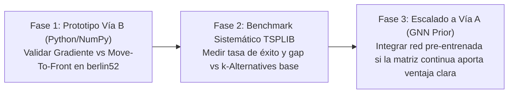

---
Gemini 3.8 Flash
---

# Propuesta Técnica: Puente entre Optimización Combinatoria (k-Alternatives) y Redes Neuronales vía Descenso del Gradiente

**Fecha:** 18 de septiembre de 2026  
**Estado:** Propuesta Conceptual / Documento de Diseño para Exploración Futura  
**Autor:** Mario Raúl Carbonell Martínez (Conceptualización k-Alternatives) &
Antigravity (Brainstorming Arquitectónico)  
**Contexto:** Proyecto `k-alternatives`
(`C:\Users\mrcm_\Local\proj\algorithms\k-alternatives`)

---

## 1. Motivación y Visión General

La optimización combinatoria clásica (como TSP o Knapsack) y el aprendizaje
profundo (Deep Learning) habitualmente se tratan como mundos desconectados:

- **La optimización clásica** opera sobre espacios discretos, permutaciones y
  grafos mediante árboles de búsqueda, ramificación y poda (_Branch & Bound_),
  metaheurísticas y búsquedas locales.
- **El Deep Learning** fundamenta todo su poder en espacios continuos y
  diferenciables mediante **descenso del gradiente**. En un espacio puramente
  discreto, las derivadas directas respecto a decisiones discretas son cero o
  discontinuas ($\nabla_\pi \text{Cost} = 0$).

El algoritmo **k-Alternatives** presenta una característica única que lo
convierte en un candidato idóneo para tender este puente: combina **Limited
Discrepancy Search (LDS)** con un **mecanismo de aprendizaje adaptativo** basado
en la reordenación dinámica de heurísticas locales (`Move-to-Front`).

Este documento registra la fundamentación matemática que conecta dicho
aprendizaje adaptativo con el descenso del gradiente, evalúa tres vías de
integración posibles y define una hoja de ruta para su desarrollo experimental
cuando se decida implementar.

---

## 2. El Vínculo Teórico: `Move-to-Front` como Gradiente Límite

En la implementación actual de _k-Alternatives_ (`src/tsp-solver.js`), cuando se
descubre una solución que mejora el récord global (`improvedRoute`), se ejecuta
`updateHeuristics`:

```javascript
_moveToFront(city, target) {
    const list = this.localHeuristics[city];
    if (list[0] === target) return;
    const idx = list.indexOf(target);
    if (idx > 0) {
        for (let k = idx; k > 0; k--) {
            list[k] = list[k - 1];
        }
        list[0] = target;
    }
}
```

### Interpretación como Descenso de Gradiente

Si formalizamos las preferencias de transición entre nodos como una matriz
continua de potenciales o _logits_ $W \in \mathbb{R}^{N \times N}$, la
probabilidad de escoger la siguiente ciudad $v$ desde $u$ sigue una política
Softmax con temperatura $\tau$:

$$\pi(v \mid u) = \frac{\exp(W_{u, v} / \tau)}{\sum_{w \in \text{unvisited}} \exp(W_{u, w} / \tau)}$$

Cuando una ruta $S^*$ supera el récord, un objetivo de aprendizaje por gradiente
que maximice la probabilidad de reproducir las aristas exitosas tendría una
pérdida de tipo entropía cruzada:

$$\mathcal{L}(W) = - \sum_{(u, v) \in S^*} \log \pi(v \mid u)$$

El gradiente respecto a los logits $W_{u, v}$ es:

$$\frac{\partial \mathcal{L}}{\partial W_{u, v}} = \pi(v \mid u) - \mathbb{I}[(u, v) \in S^*]$$

- **Un paso de gradiente continuo** aumentaría $W_{u, v^*}$ de forma
  proporcional al learning rate $\eta$:
  $$W_{u, v^*} \leftarrow W_{u, v^*} + \eta \cdot (1 - \pi(v^* \mid u))$$
- **El Move-to-Front actual de k-Alternatives** representa el **caso límite
  discreto** donde $\eta \to \infty$: Inmediatamente promueve $v^*$ a la primera
  posición absoluta (rango 0), sin calcular probabilidades ni ponderar la
  magnitud de la mejora.

### Limitaciones de la versión discreta actual

1. **Olvido catastrófico rápido:** Si una ruta ligeramente mejor introduce una
   arista subóptima por azar, `_moveToFront` borra inmediatamente la posición de
   la arista previa.
2. **Falta de modulación por recompensa:** Una mejora del $0.01\%$ tiene
   exactamente el mismo impacto en la política que una mejora del $15\%$.
3. **Pérdida de relaciones de segundo orden:** Solo la primera posición
   (`list[0]`) se beneficia directamente; las posiciones intermedias sufren
   desplazamientos pasivos.

---

## 3. Las Tres Vías de Integración

Se han explorado tres enfoques conceptuales para unir _k-Alternatives_ con redes
neuronales y descenso del gradiente:

```mermaid
graph TD
    subgraph "Vía A: Modelo Pre-entrenado"
        A1["Grafo TSP (Coordenadas)"] --> A2["GNN / Transformer"]
        A2 -- "Descenso Gradiente (Offline RL)" --> A2
        A2 --> A3["Matriz de Probabilidades P(e)"]
        A3 --> A4["k-Alternatives Decoder (LDS)"]
        A4 --> A5["Solución Final"]
    end

    subgraph "Vía B: Optimizador In-Instance"
        B1["Instancia Única (ej. berlin52)"] --> B2["Matriz Continua W (Logits)"]
        B2 --> B3["Búsqueda k-Alternatives"]
        B3 --> B4{"¿Nueva Solución Élite?"}
        B4 -- Sí --> B5["Loss L(W) + Regularización"]
        B5 -- "Descenso Gradiente (Online Adam/SGD)" --> B2
        B4 -- No --> B3
    end

    subgraph "Vía C: Búsqueda Diferenciable"
        C1["Árbol de Decisión LDS"] --> C2["Relajación Continua (Gumbel / Soft-Top-K)"]
        C2 --> C3["Gradiente fluye a través de la poda"]
    end

    subgraph "Vía D: Zero-Order Estructurado (añadida 19-sep-2026)"
        D1["Par de soluciones hermanas (S_k=0, S_k=1)"] --> D2["Δ = aristas intercambiadas"]
        D2 --> D3["Δ/k como dirección de descenso ESTRUCTURADA"]
        D3 -- "Adam / SGD" --> D4["Parámetros θ de la red"]
        D5["SPSA / MeZO / DGE: ruido isotrópico SIN significado"] -.->|"contraste"| D2
    end
```



---

### Vía A: Red Neuronal Pre-entrenada + k-Alternatives como Decodificador

- **Concepto:** Una red neuronal (Graph Neural Network o Transformer de atención
  espacial) procesa las coordenadas del problema y genera una matriz de
  afinidades $P(e_{ij} \in \text{tour óptimo})$.
- **Papel de k-Alternatives:** En lugar de ordenar los vecinos por distancia
  euclidiana, `k-optimizer` inicializa `localHeuristics` con el ranking
  descendente de probabilidades predichas por la red.
- **Entrenamiento con REINFORCE (Policy Gradient):**
  $$\nabla_\theta J(\theta) = \mathbb{E}_{\tau \sim \pi_\theta} \Big[ (C(\tau) - b) \nabla_\theta \log \pi_\theta(\tau) \Big]$$
  donde el _baseline_ $b$ es la solución generada con $k=0$ (greedy de la red).
  La red aprende a ordenar las aristas de modo que la búsqueda $k$-Alternatives
  necesite el mínimo presupuesto $k$ para cerrar el ciclo óptimo.
- **Ventajas:**
    - Inferencia casi instantánea (fracciones de segundo) una vez entrenado el
      modelo.
    - Supera ampliamente a decodificadores ingenuos (greedy puro o sampling
      aleatorio) usados en la literatura de _Neural Combinatorial Optimization_
      (NCO).
- **Inconvenientes:**
    - Requiere pre-entrenar con cientos de miles de grafos sintéticos.
    - Sufre el problema de generalización de escala: un modelo entrenado en
      $N=50$ pierde precisión notablemente al evaluar $N=200$.
    - Requiere dependencias pesadas de Machine Learning (PyTorch, GPUs).

---

### Vía B: Optimizador Continuo "In-Instance" (Gradiente como sustituto de Move-to-Front)

- **Concepto:** Resolver **una sola instancia** (ej. un archivo TSPLIB
  específico) sin ningún entrenamiento previo. Se sustituyen las listas
  discretas de permutación por una matriz continua
  $W \in \mathbb{R}^{N \times N}$.
- **Mecánica del Algoritmo:**
    1. **Inicialización:** $W_{ij} = -d_{ij}$ (el inverso de la distancia
       euclidiana) o normalizado mediante Softmax.
    2. **Generación con k-discrepancias:** En cada iteración, las alternativas
       $0, 1, \dots$ se extraen ordenando los valores continuos de la fila
       $W_{u, :}$.
    3. **Evaluación de Soluciones Élite:** Se mantiene un buffer de las $M$
       mejores soluciones encontradas ($\mathcal{E}$).
    4. **Paso de Descenso de Gradiente:**
       $$\mathcal{L}(W) = \sum_{S \in \mathcal{E}} \omega_S \sum_{(u, v) \in S} -\log \frac{\exp(W_{u, v} / \tau)}{\sum_w \exp(W_{u, w} / \tau)} + \lambda \|W - W_{\text{distancia}}\|^2$$
       donde $\omega_S$ pondera según la calidad de la ruta, $\tau$ es la
       temperatura, y $\lambda$ mantiene anclada la memoria espacial para evitar
       desvíos absurdos. $$W \leftarrow W - \eta \nabla_W \mathcal{L}$$
- **Ventajas:**
    - **Cero necesidad de datos o pre-entrenamiento:** Es 100% autocontenido y
      funciona para cualquier tamaño $N$.
    - **Memoria estadística continua:** Elimina el olvido catastrófico de
      `_moveToFront`.
    - **Ligero y compatible:** Puede ejecutarse en CPU o aceleradores estándar
      (NumPy, PyTorch con `torch-directml` en GPUs integradas AMD/Radeon, o
      tensores en JavaScript).
- **Inconvenientes:**
    - Cada iteración tiene mayor coste computacional que los intercambios O(1)
      de listas de enteros.
    - Introduce hiperparámetros continuos: learning rate ($\eta$), temperatura
      ($\tau$) y peso de regularización ($\lambda$).

---

### Vía C: Búsqueda de Discrepancias Diferenciable (End-to-End LDS)

- **Concepto:** Diferenciar directamente la ejecución del algoritmo de búsqueda
  recursivo (`systematicSearch`).
- **Mecánica:**
    - La decisión binaria de podar o explorar una alternativa se sustituye por
      una compuerta continua mediante **Gumbel-Softmax** o relajaciones de
      operadores de ordenación (_Soft-Top-K_ / _Perturbed Optimizers_).
    - El presupuesto $k$ consumido se modela como una penalización continua en
      la función de coste.
    - El gradiente de la longitud final del tour fluye hacia atrás a través del
      árbol de búsqueda para ajustar parámetros que predicen **dónde conviene
      gastar las discrepancias** (por ejemplo, detectar zonas de alta
      incertidumbre o cuellos de botella topológicos).
- **Ventajas:**
    - Máxima elegancia matemática: permite aprender meta-políticas de poda y
      asignación de presupuesto.
- **Inconvenientes:**
    - Riesgo técnico extremo: los grafos de cómputo en búsquedas combinatorias
      profundas sufren de explosión o desvanecimiento severo del gradiente.
    - Altamente complejo de depurar y estabilizar numéricamente.

---

## 4. Matriz de Evaluación Comparativa

| Criterio                        | Vía A: GNN + k-Decoder                  | Vía B: In-Instance Gradient                      | Vía C: LDS Diferenciable                 |
| :------------------------------ | :-------------------------------------- | :----------------------------------------------- | :--------------------------------------- |
| **Rol del Gradiente**           | Entrena la red previa (offline)         | Optimiza los logits de la instancia (online)     | Fluye a través de la búsqueda en árbol   |
| **Complejidad de Código**       | Alta (PyTorch, GNNs, RL loop)           | **Media-Baja** (NumPy o PyTorch simple)          | Muy Alta (autograd custom, relajaciones) |
| **Necesidad de Datos Previos**  | Sí (millones de problemas generados)    | **Cero** (resuelve la instancia en vivo)         | Depende de la formulación                |
| **Requisitos de Hardware**      | Altos para entrenamiento (GPU dedicada) | **Bajos** (óptimo en CPU o iGPU Radeon 780M)     | Medios                                   |
| **Sensibilidad a Escala ($N$)** | Alta (degrada fuera de distribución)    | **Nula** (se adapta a cualquier $N$)             | Moderada                                 |
| **Fidelidad a k-Alternatives**  | k-Alternatives queda como subordinado   | **Evolución directa y natural de Move-to-Front** | Transforma la búsqueda en relajación     |
| **Riesgo Técnico**              | Medio                                   | **Bajo**                                         | Muy Alto                                 |
| **Time-to-Insight**             | Semanas                                 | **1 - 2 días de prototipado**                    | Semanas / Meses                          |

---

## 5. Recomendación y Hoja de Ruta Experimental

Cuando se decida retomar esta investigación, el camino recomendado es abordar
**la Vía B** como primer hito de validación empírica:



### Plan de Validación para la Fase 1:

1. **Entorno:** Script en Python utilizando NumPy o PyTorch ligero
   (`torch-directml` o CPU).
2. **Caso de prueba:** Instancia estándar `berlin52.tsp` (o
   `tsplib-json/berlin52.json`).
3. **Métricas a contrastar:**
    - **Baseline:** $k$-Alternatives clásico con `_moveToFront` (código
      JavaScript actual portado o ejecutado en paralelo).
    - **Tratamiento:** $k$-Alternatives donde `heuristics[u]` se obtiene del
      orden inducido por $W$, actualizado con descenso de gradiente Adam tras
      cada récord.
    - **Pregunta clave a responder:** ¿La convergencia suave del gradiente logra
      escapar de los óptimos locales donde el Move-to-Front discreto se queda
      estancado?

---

## 6. Referencias y Conexiones Académicas

1. **Harvey, W. D., & Ginsberg, M. L. (1995).** _Limited Discrepancy Search._
   IJCAI. (Base teórica del parámetro $k$).
2. **Kool, W., van Hoof, H., & Welling, M. (2019).** _Attention, Learn to Solve
   Routing Problems!_ ICLR. (Uso de Attention Models con decodificadores greedy
   como baseline en RL).
3. **Vlastelica, M. et al. (2020).** _Differentiation of Blackbox Combinatorial
   Solvers._ ICLR. (Técnicas de relajación continua sobre algoritmos discretos
   de grafos).
4. **Bello, I. et al. (2016).** _Neural Combinatorial Optimization with
   Reinforcement Learning._ arXiv:1611.09940.

---

GLM 5.3 Flash

---

Ya leí el README completo. Me parece un algoritmo muy bien diseñado, y lo
interesante es que **ya es más "diferenciable de lo que crees"**. Vamos al
brainstorming.

## Lo que tiene tu algoritmo que es "puenteable" a gradientes

Tu mecanismo de aprendizaje adaptativo es, conceptualmente, un **softmax con
bias entrenable disfrazado de reordenamiento de listas**:

- `heuristics[city]` = una lista ordenada de preferencias → eso es exactamente
  un **logit vector** $\theta_{city} \in \mathbb{R}^n$, donde la posición en la
  lista es el _rank_ implícito.
- `updateHeuristics()` (mover al frente) = un **paso de gradiente duro** (hard
  gradient step) con learning rate "all-or-nothing":
  $\theta \leftarrow \theta + e_{city2} - e_{city1}$.
- El parámetro `k` = **temperatura de exploración** cuantizada.

Es decir, tu algoritmo ya hace RL sin saberlo; la pregunta es cómo hacerlo
**suave** para que fluyan gradientes.

## Tres arquitecturas concretas para el puente

### 1. K-Alternatives como capa diferenciable (la más directa)

Reemplaza el "tomar el mejor de la lista" por una **selección con softmax +
Gumbel**:

$$P(\text{elegir } j \mid \text{estado } i) = \text{softmax}(\theta_{ij} / \tau)$$

- La construcción de la solución se hace muestreando de esta distribución (esto
  es literalmente un **Pointer Network** / construcción autoregresiva tipo
  transformer decoder, donde tu "heurística inicial" es la **inicialización de
  los logits** — un warm-start enorme comparado con entrenar de cero).
- El `k`-ésimo desvío se modela naturalmente: muestrear del top-k de la
  distribución en vez del argmax. Puedes incluso hacer que `k` sea **aprendido**
  (una salida extra de la red con Gumbel-softmax).
- El gradiente puede fluir por dos caminos: **REINFORCE** (reward = −costo de la
  solución, como tus "updates solo en mejora") o **Gumbel-Softmax con
  relajación** si puedes escribir el costo de forma diferenciable (Knapsack sí:
  la relajación LP del knapsack es diferenciable; TSP necesita la relajación de
  la matriz de permutación).

**Tu ventaja competitiva aquí:** entrenar Pointer Networks desde cero es
carísimo; con tu heurística como init + tus updates de reordenamiento como
pretraining, llegas a una red ya "casi buena".

### 2. Tu update como.loss suavizada (la más fiel a tu algoritmo)

Mantén todo el algoritmo tal cual, pero sustituye el "mover al frente" por un
**descenso de gradiente real** sobre los logits:

$$\theta_{ij} \leftarrow \theta_{ij} - \eta \cdot \nabla_\theta \mathcal{L}(x)$$

con $\mathcal{L}$ = costo de la solución construida (o un surrogate suave: coste
relajado, ranking loss, etc.). Tu "mover al frente" es el caso límite
$\eta \to \infty$ con gradiente esparse. Esto es básicamente **S2V-DQN /
learning-to-rank diferenciable**, y te da:

- learning rate tunable (tu único hiperparámetro pasa de `k` a `{k, η, τ}`),
- convergencia más suave y menos "catastrófica" que el reordenamiento binario
  (un mal movimiento borra de golpe todo el learning en tu versión; con η finito
  no),
- ¡y además `k` se puede Schedule mediante el τ (temperatura de entropía)!

### 3. K-Alternatives dentro del entrenamiento (como搜索 de la red)

Invierte el rol: usa tu algoritmo como **generador de datos / guía de búsqueda**
dentro del training loop de una red (estilo AlphaZero pero barato):

- La red predice logits por estado → tu constructor k-Alternatives explora con
  desvíos → las soluciones mejoradas se destilan de vuelta en la red con
  MSE/cross-entropy sobre los logits (esto es _policy distillation_ de tu
  búsqueda).
- Es el patrón **"search as teacher, network as student"** y no requiere
  diferenciabilidad del problema en absoluto — solo que la búsqueda sea buena. Y
  tu búsqueda ya demostró serlo (2-3% del óptimo).

## Comparación honesta

| Enfoque                                     | Diferenciable 100%?          | Riesgo                                         | Aporte de k-Alternatives                                    |
| ------------------------------------------- | ---------------------------- | ---------------------------------------------- | ----------------------------------------------------------- |
| 1. Capa diferenciable (PointerNet + Gumbel) | Sí                           | Entrenamiento inestable, requiere relajaciones | Warm-start de logits + política de exploración k            |
| 2. Gradiente sobre tus logits               | Parcial (permutation ≠ diff) | Necesita surrogate suave                       | Reemplaza tu update hard por soft, cambia poco el algoritmo |
| 3. Search-as-teacher / distillation         | No requiere                  | No es "puente" puro, más ML clásico            | La búsqueda es el teacher barato                            |

## Mi recomendación de ruta

1. **Empezar por el Knapsack**: su costo es lineal y su relajación
   (fraccionaria) es diferenciable — es el problema más "amigable" para
   gradiente. TSP con permutaciones es el caso duro (necesita Gumbel-Sinkhorn
   para la matriz de adyacencia).
2. Implementar la **Opción 2 primero** (gradiente suave sobre tus heuristics,
   todo lo demás igual): es cambio mínimo en tu código (`k-optimizer.js`),
   comparable directamente contra tu versión actual, y valida si el gradiente
   suave mejora sobre tu update hard.
3. Si eso funciona, saltar a la **Opción 1** con Gumbel-softmax y `k` aprendido.

Pregunta clave para ti: ¿te interesa más la **pureza matemática** (todo
end-to-end diferenciable, opción 1) o la **pragmática** (mantener tu algoritmo,
solo suavizar el aprendizaje, opciones 2-3)? Eso define cuánta infraestructura
de entrenamiento (PyTorch vs tu JS actual) hay que montar.

---

## Continuación (19-sep-2026)

Una sesión posterior de análisis profundizó en la fundamentación matemática de
esta propuesta y añadió resultados que **no están cubiertos aquí**. Se
registraron en un documento aparte para no alterar este texto original:

👉
**[`puente-gradiente-k-alternatives.md`](puente-gradiente-k-alternatives.md)**

Aportaciones nuevas de ese documento:

1. **Formalización exacta del update:** `_moveToFront` es un paso de
   _Exponentiated Gradient / Mirror Descent (KL)_ **exacto** más una
   **re-cuantización** que destruye la magnitud. Los tres defectos listados en
   §2 de este documento tienen así una **causa raíz única**.
2. **Familia interpolante de un parámetro:** `η → ∞` reproduce exactamente la
   versión discreta actual; `η` finito da NES / Cross-Entropy Method.
   k-Alternatives es un **NES/EDA degenerado**, lo que aporta coartada literaria
   y garantías de convergencia.
3. **Conexión con _blackbox differentiation_** (Vlastelica et al., ICLR 2020):
   el presupuesto `k` **es** el hiperparámetro `λ` de disrupción, con semántica
   de grafo. k-Alternatives genera gratis el par `(y, y_λ)` que esa literatura
   obtiene con un solver perturbado.
4. **Vía D — _zero-order_ estructurado** (no contemplada aquí): las
   k-desviaciones son **direcciones de perturbación semánticas** frente al ruido
   isotrópico de SPSA/MeZO/DGE. Puente directo con la línea `dge-optimizer` /
   `cameo-zo`.
5. **Hipótesis falsable nueva:** `k₅₀ = k₅₀(W₀)`, es decir, que el umbral de
   discrepancia depende de la **calidad del prior**, no del problema. Si se
   confirma, **`k` es aprendible** y deja de ser un hiperparámetro.
6. **Evidencia externa relevante:** Liu, Zhang, Tang & Yao (IEEE CIM, 2023)
   muestran que los solvers NCO **no superan** a los solvers clásicos en casi
   ningún eje (efectividad, eficiencia, estabilidad, escalabilidad,
   generalización). Recomiendan no competir con LKH/Concorde y reformular el
   _claim_.
7. **Restricción de diseño:** puentear la **política** (logits), **no la
   búsqueda**. La poda (`canPrune`) debe seguir siendo dura para conservar
   garantías.
