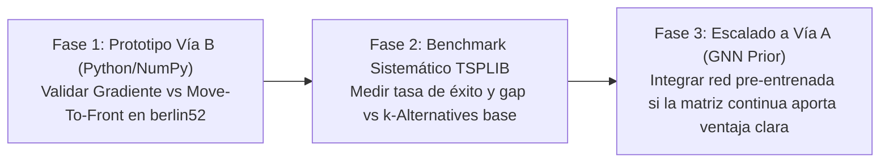

# Propuesta Técnica: Puente entre Optimización Combinatoria (k-Alternatives) y Redes Neuronales vía Descenso del Gradiente

**Fecha:** 18 de septiembre de 2026  
**Estado:** Propuesta Conceptual / Documento de Diseño para Exploración Futura  
**Autor:** Mario Raúl Carbonell Martínez  
**Contexto:** Proyecto `k-alternatives`

---

## 1. Motivación y Visión General

La optimización combinatoria clásica (como TSP o Knapsack) y el aprendizaje
profundo (Deep Learning) habitualmente se tratan como mundos desconectados:

- **La optimización clásica** opera sobre espacios discretos, permutaciones y
  grafos mediante árboles de búsqueda, ramificación y poda (_Branch & Bound_),
  metaheurísticas y búsquedas locales.
- **El Deep Learning** fundamenta todo su poder en espacios continuos y
  diferenciables mediante **descenso del gradiente**. En un espacio puramente
  discreto, las derivadas directas respecto a decisiones discretas son cero o
  discontinuas ($\nabla_\pi \text{Cost} = 0$).

El algoritmo **k-Alternatives** presenta una característica destacada que lo
convierte en un candidato idóneo para tender este puente: combina **Limited
Discrepancy Search (LDS)** con un **mecanismo de aprendizaje adaptativo** basado
en la reordenación dinámica de heurísticas locales (`Move-to-Front`).

Este documento registra la fundamentación matemática que conecta dicho
aprendizaje adaptativo con el descenso del gradiente, evalúa tres vías de
integración posibles y define una hoja de ruta para su desarrollo experimental.

---

## 2. El Vínculo Teórico: `Move-to-Front` como Gradiente Límite

En la implementación actual de _k-Alternatives_ (`src/tsp-solver.js`), cuando se
descubre una solución que mejora el récord global (`improvedRoute`), se ejecuta
`updateHeuristics`:

```javascript
_moveToFront(city, target) {
    const list = this.localHeuristics[city];
    if (list[0] === target) return;
    const idx = list.indexOf(target);
    if (idx > 0) {
        for (let k = idx; k > 0; k--) {
            list[k] = list[k - 1];
        }
        list[0] = target;
    }
}
```

### Interpretación como Descenso de Gradiente

Si formalizamos las preferencias de transición entre nodos como una matriz
continua de potenciales o _logits_ $W \in \mathbb{R}^{N \times N}$, la
probabilidad de escoger la siguiente ciudad $v$ desde $u$ sigue una política
Softmax con temperatura $\tau$:

$$\pi(v \mid u) = \frac{\exp(W_{u, v} / \tau)}{\sum_{w \in \text{unvisited}} \exp(W_{u, w} / \tau)}$$

Cuando una ruta $S^*$ supera el récord, un objetivo de aprendizaje por gradiente
que maximice la probabilidad de reproducir las aristas exitosas tendría una
pérdida de tipo entropía cruzada:

$$\mathcal{L}(W) = - \sum_{(u, v) \in S^*} \log \pi(v \mid u)$$

El gradiente respecto a los logits $W_{u, v}$ es:

$$\frac{\partial \mathcal{L}}{\partial W_{u, v}} = \pi(v \mid u) - \mathbb{I}[(u, v) \in S^*]$$

- **Un paso de gradiente continuo** aumentaría $W_{u, v^*}$ de forma
  proporcional al learning rate $\eta$:
  $$W_{u, v^*} \leftarrow W_{u, v^*} + \eta \cdot (1 - \pi(v^* \mid u))$$
- **El Move-to-Front actual de k-Alternatives** representa el **caso límite
  discreto** donde $\eta \to \infty$: Inmediatamente promueve $v^*$ a la primera
  posición absoluta (rango 0), sin calcular probabilidades ni ponderar la
  magnitud de la mejora.

### Limitaciones de la versión discreta actual

1. **Olvido rápido:** Si una ruta ligeramente mejor introduce una arista
   subóptima por azar, `_moveToFront` modifica inmediatamente la posición de la
   arista previa.
2. **Falta de modulación por recompensa:** Una mejora del $0.01\%$ tiene el
   mismo impacto en la política que una mejora del $15\%$.
3. **Pérdida de relaciones de segundo orden:** Solo la primera posición
   (`list[0]`) se beneficia directamente; las posiciones intermedias sufren
   desplazamientos pasivos.

---

## 3. Las Vías de Integración

Se han explorado varias vías conceptuales para unir _k-Alternatives_ con redes
neuronales y descenso del gradiente:


```mermaid
graph TD
    subgraph "Vía A: Modelo Pre-entrenado"
        A1["Grafo TSP (Coordenadas)"] --> A2["GNN / Transformer"]
        A2 -- "Descenso Gradiente (Offline RL)" --> A2
        A2 --> A3["Matriz de Probabilidades P(e)"]
        A3 --> A4["k-Alternatives Decoder (LDS)"]
        A4 --> A5["Solución Final"]
    end

    subgraph "Vía B: Optimizador In-Instance"
        B1["Instancia Única (ej. berlin52)"] --> B2["Matriz Continua W (Logits)"]
        B2 --> B3["Búsqueda k-Alternatives"]
        B3 --> B4{"¿Nueva Solución Élite?"}
        B4 -- Sí --> B5["Loss L(W) + Regularización"]
        B5 -- "Descenso Gradiente (Online Adam/SGD)" --> B2
        B4 -- No --> B3
    end

    subgraph "Vía C: Búsqueda Diferenciable"
        C1["Árbol de Decisión LDS"] --> C2["Relajación Continua (Gumbel / Soft-Top-K)"]
        C2 --> C3["Gradiente fluye a través de la poda"]
    end

    subgraph "Vía D: Zero-Order Estructurado"
        D1["Par de soluciones hermanas (S_k=0, S_k=1)"] --> D2["Δ = aristas intercambiadas"]
        D2 --> D3["Δ/k como dirección de descenso ESTRUCTURADA"]
        D3 -- "Adam / SGD" --> D4["Parámetros θ de la red"]
    end
```

---

### Vía A: Red Neuronal Pre-entrenada + k-Alternatives como Decodificador

- **Concepto:** Una red neuronal (Graph Neural Network o Transformer de atención
  espacial) procesa las coordenadas del problema y genera una matriz de
  afinidades $P(e_{ij} \in \text{tour óptimo})$.
- **Papel de k-Alternatives:** En lugar de ordenar los vecinos por distancia
  euclidiana, `k-optimizer` inicializa `localHeuristics` con el ranking
  descendente de probabilidades predichas por la red.
- **Entrenamiento con REINFORCE (Policy Gradient):**
  $$\nabla_\theta J(\theta) = \mathbb{E}_{\tau \sim \pi_\theta} \Big[ (C(\tau) - b) \nabla_\theta \log \pi_\theta(\tau) \Big]$$
  donde el _baseline_ $b$ es la solución generada con $k=0$ (greedy de la red).
  La red aprende a ordenar las aristas de modo que la búsqueda $k$-Alternatives
  necesite el mínimo presupuesto $k$ para cerrar el ciclo óptimo.

---

### Vía B: Optimizador Continuo "In-Instance" (Gradiente como sustituto de Move-to-Front)

- **Concepto:** Resolver **una sola instancia** (ej. un archivo TSPLIB
  específico) sin ningún entrenamiento previo. Se sustituyen las listas
  discretas de permutación por una matriz continua
  $W \in \mathbb{R}^{N \times N}$.
- **Mecánica del Algoritmo:**
    1. **Inicialización:** $W_{ij} = -d_{ij}$ (el inverso de la distancia
       euclidiana) o normalizado mediante Softmax.
    2. **Generación con k-discrepancias:** En cada iteración, las alternativas
       $0, 1, \dots$ se extraen ordenando los valores continuos de la fila
       $W_{u, :}$.
    3. **Evaluación de Soluciones Élite:** Se mantiene un buffer de las $M$
       mejores soluciones encontradas ($\mathcal{E}$).
    4. **Paso de Descenso de Gradiente:**
       $$\mathcal{L}(W) = \sum_{S \in \mathcal{E}} \omega_S \sum_{(u, v) \in S} -\log \frac{\exp(W_{u, v} / \tau)}{\sum_w \exp(W_{u, w} / \tau)} + \lambda \|W - W_{\text{distancia}}\|^2$$
       $$W \leftarrow W - \eta \nabla_W \mathcal{L}$$

---

### Vía C: Búsqueda de Discrepancias Diferenciable (End-to-End LDS)

- **Concepto:** Diferenciar directamente la ejecución del algoritmo de búsqueda
  recursivo (`systematicSearch`).
- **Mecánica:**
    - La decisión binaria de podar o explorar una alternativa se sustituye por
      una compuerta continua mediante **Gumbel-Softmax** o relajaciones de
      operadores de ordenación (_Soft-Top-K_ / _Perturbed Optimizers_).
    - El presupuesto $k$ consumido se modela como una penalización continua en
      la función de coste.

---

## 4. Matriz de Evaluación Comparativa

| Criterio                        | Vía A: GNN + k-Decoder                  | Vía B: In-Instance Gradient                      | Vía C: LDS Diferenciable                 |
| :------------------------------ | :-------------------------------------- | :----------------------------------------------- | :--------------------------------------- |
| **Rol del Gradiente**           | Entrena la red previa (offline)         | Optimiza los logits de la instancia (online)     | Fluye a través de la búsqueda en árbol   |
| **Complejidad de Código**       | Alta (PyTorch, GNNs, RL loop)           | **Media-Baja** (NumPy o PyTorch simple)          | Muy Alta (autograd custom, relajaciones) |
| **Necesidad de Datos Previos**  | Sí (millones de problemas generados)    | **Cero** (resuelve la instancia en vivo)         | Depende de la formulación                |
| **Requisitos de Hardware**      | Altos para entrenamiento (GPU dedicada) | **Bajos** (óptimo en CPU o iGPU Radeon 780M)     | Medios                                   |
| **Sensibilidad a Escala ($N$)** | Alta (degrada fuera de distribución)    | **Nula** (se adapta a cualquier $N$)             | Moderada                                 |
| **Fidelidad a k-Alternatives**  | k-Alternatives queda como subordinado   | **Evolución directa y natural de Move-to-Front** | Transforma la búsqueda en relajación     |
| **Riesgo Técnico**              | Medio                                   | **Bajo**                                         | Muy Alto                                 |
| **Time-to-Insight**             | Semanas                                 | **1 - 2 días de prototipado**                    | Semanas / Meses                          |

---

## 5. Recomendación y Hoja de Ruta Experimental

Cuando se decida retomar esta investigación, el camino recomendado es abordar
**la Vía B** como primer hito de validación empírica:


```mermaid
flowchart LR
    P1["Fase 1: Prototipo Vía B (Python/NumPy)<br>Validar Gradiente vs Move-To-Front en berlin52"]
    P2["Fase 2: Benchmark Sistemático TSPLIB<br>Medir tasa de éxito y gap vs k-Alternatives base"]
    P3["Fase 3: Escalado a Vía A (GNN Prior)<br>Integrar red pre-entrenada si la matriz continua aporta ventaja clara"]

    P1 --> P2 --> P3
```

---

## 6. Referencias y Conexiones Académicas

1. **Harvey, W. D., & Ginsberg, M. L. (1995).** _Limited Discrepancy Search._
   IJCAI.
2. **Kool, W., van Hoof, H., & Welling, M. (2019).** _Attention, Learn to Solve
   Routing Problems!_ ICLR.
3. **Vlastelica, M. et al. (2020).** _Differentiation of Blackbox Combinatorial
   Solvers._ ICLR.
4. **Bello, I. et al. (2016).** _Neural Combinatorial Optimization with
   Reinforcement Learning._ arXiv:1611.09940.

---

Para profundizar en la equivalencia matemática rigurosa entre `_moveToFront` y
_Mirror Descent / Exponentiated Gradient_, consúltese:  
👉 **[`puente-gradiente-k-alternatives.md`](puente-gradiente-k-alternatives.md)**
